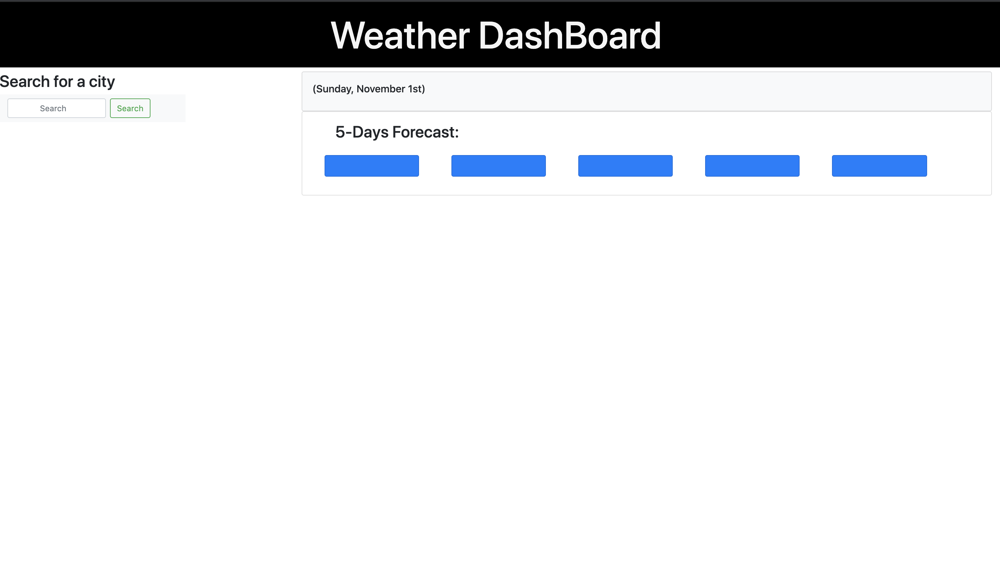
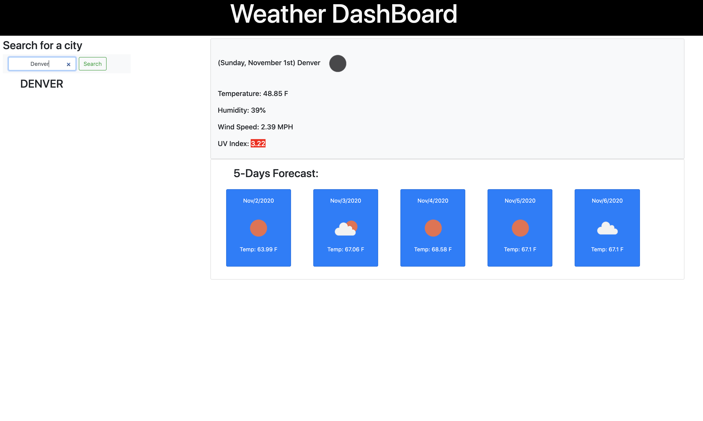

# Weather-Dashboard

## how to use Weather Dashboard.

With Weather Dash board yu can check the current weather and next 5 days so you
can plan your week.

- Enter the city Name you like to check.
- click the search button and weather data will display.
- To check a different city simply enter another city in the search field and
  click search again.
- On the left panel you can see your search history with all the cities you have
  searched.

## Purpose of the application.

To have Reliable weather data for your week.

### built with

- HTML
- CSS
- JavaScript

**deployed application link**
https://bannoura9.github.io/Weatherdashboard/Develop/index.html

**GitHub application link** https://github.com/bannoura9/Weatherdashboard

##### Screenshots.

  

